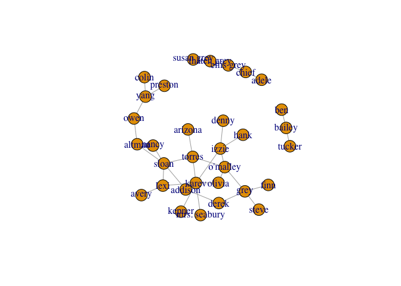
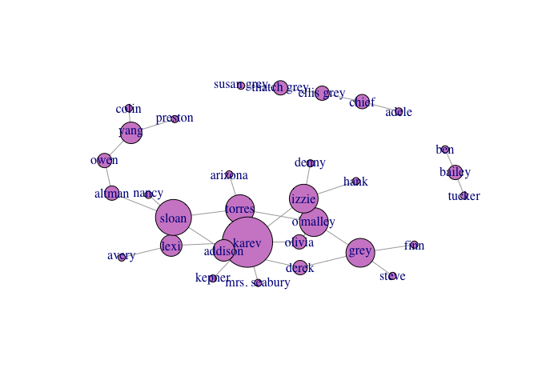
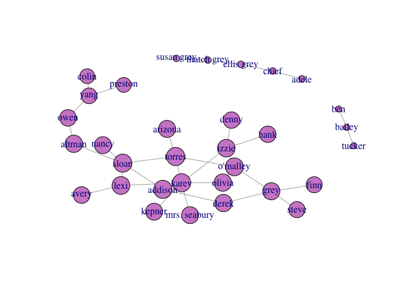
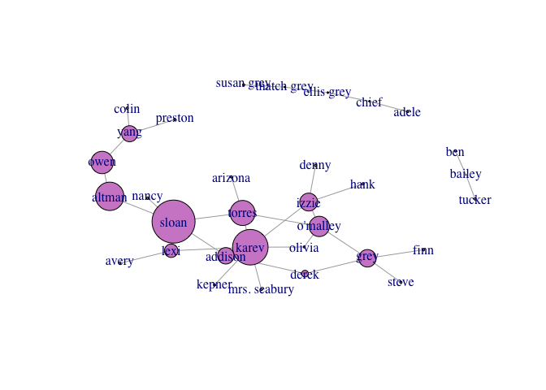
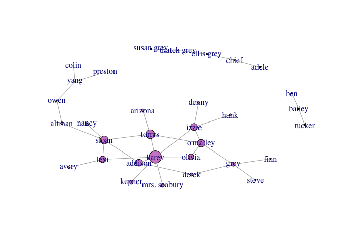
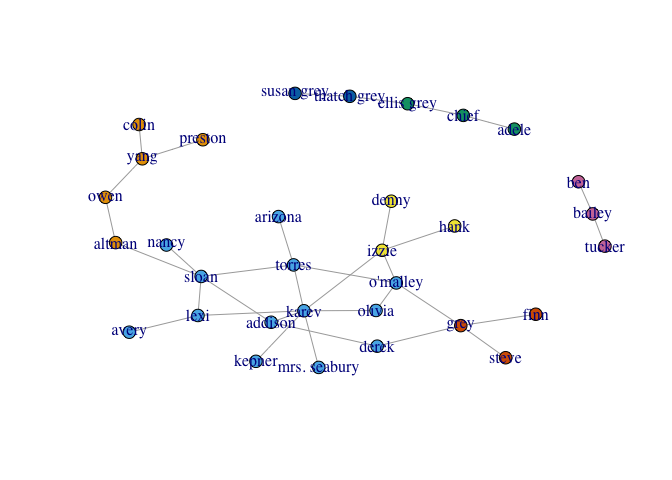
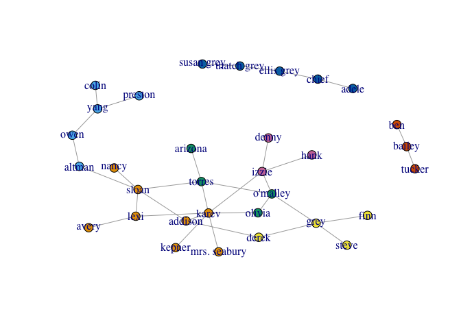

# Grey’s Anatomy Graph Analysis
Lidan Hifi and Hagai Levi  
9 April 2016  

This is the third assignment in introduction to data science course at Ben Gurion University, May 2016.

The main idea of this assignment is analyzing networks- basic metrics of graphs and clustering.   In this assignment we'll make some research on Grey's anatomy characters.


# Loading data
The graph represent relationships between characters in Grey's anatomy.
It is represented by a two-columns csv file, contains [from, to] pairs.

```r
ga.data <- read.csv('ga_edgelist.csv', header = TRUE)
g <- graph.data.frame(ga.data, directed = FALSE)

# remove self loops
g <- simplify(g)
```

# Data exploration
We'll start with a basic data exploration in order to understand the given dataset and the structure of the graph.
Basic exploration:

```r
head(ga.data)
```

```
##    from     to
## 1  lexi  sloan
## 2  lexi  karev
## 3  owen   yang
## 4  owen altman
## 5 sloan torres
## 6 sloan altman
```

characters (graph vertices):

```r
V(g)$name
```

```
##  [1] "lexi"         "owen"         "sloan"        "torres"      
##  [5] "derek"        "karev"        "o'malley"     "yang"        
##  [9] "grey"         "chief"        "ellis grey"   "susan grey"  
## [13] "bailey"       "izzie"        "altman"       "arizona"     
## [17] "colin"        "preston"      "kepner"       "addison"     
## [21] "nancy"        "olivia"       "mrs. seabury" "adele"       
## [25] "thatch grey"  "tucker"       "hank"         "denny"       
## [29] "finn"         "steve"        "ben"          "avery"
```

connections between characters:

```r
summary(g)
```

```
## IGRAPH UN-- 32 34 -- 
## + attr: name (v/c)
```

graph visualization:

```r
# set seed to make the layout reproducible
set.seed(100)
default_layout = layout.fruchterman.reingold(g)
plot(g, layout = default_layout)
```



## Degree score

```r
degree.score <- degree(g)
V(g)$color <- "#d08bcd"
plot(g, layout = default_layout, vertex.size=degree.score * 4, asp=FALSE)
```



```r
degree.score
```

```
##         lexi         owen        sloan       torres        derek 
##            3            2            5            4            2 
##        karev     o'malley         yang         grey        chief 
##            7            4            3            4            2 
##   ellis grey   susan grey       bailey        izzie       altman 
##            2            1            2            4            2 
##      arizona        colin      preston       kepner      addison 
##            1            1            1            1            3 
##        nancy       olivia mrs. seabury        adele  thatch grey 
##            1            2            1            1            2 
##       tucker         hank        denny         finn        steve 
##            1            1            1            1            1 
##          ben        avery 
##            1            1
```

## Closeness centrality

```r
g.closeness <- closeness(g)
V(g)$color <- "#d08bcd"
plot(g, layout = default_layout, vertex.size=g.closeness * 4000, asp=FALSE)
```



```r
g.closeness
```

```
##         lexi         owen        sloan       torres        derek 
##  0.003115265  0.002898551  0.003174603  0.003194888  0.003039514 
##        karev     o'malley         yang         grey        chief 
##  0.003174603  0.003134796  0.002754821  0.003003003  0.001148106 
##   ellis grey   susan grey       bailey        izzie       altman 
##  0.001149425  0.001144165  0.001075269  0.003076923  0.003039514 
##      arizona        colin      preston       kepner      addison 
##  0.002985075  0.002597403  0.002597403  0.002967359  0.003174603 
##        nancy       olivia mrs. seabury        adele  thatch grey 
##  0.002967359  0.003039514  0.002967359  0.001144165  0.001148106 
##       tucker         hank        denny         finn        steve 
##  0.001074114  0.002881844  0.002881844  0.002816901  0.002816901 
##          ben        avery 
##  0.001074114  0.002915452
```

```r
which.max(g.closeness)
```

```
## torres 
##      4
```

**Torres** is the most central by closeness centrality metric.

## Betweeness centrality

```r
g.betweenness <- betweenness(g)
V(g)$color <- "#d08bcd"
plot(g, layout = default_layout, vertex.size=g.betweenness / 5, asp=FALSE)
```



```r
g.betweenness
```

```
##         lexi         owen        sloan       torres        derek 
##     36.00000     60.00000    115.36667     67.15000     17.95000 
##        karev     o'malley         yang         grey        chief 
##     95.26667     54.41667     43.00000     46.86667      3.00000 
##   ellis grey   susan grey       bailey        izzie       altman 
##      4.00000      0.00000      1.00000     47.95000     76.00000 
##      arizona        colin      preston       kepner      addison 
##      0.00000      0.00000      0.00000      0.00000     44.08333 
##        nancy       olivia mrs. seabury        adele  thatch grey 
##      0.00000      4.95000      0.00000      0.00000      3.00000 
##       tucker         hank        denny         finn        steve 
##      0.00000      0.00000      0.00000      0.00000      0.00000 
##          ben        avery 
##      0.00000      0.00000
```

```r
which.max(g.betweenness)
```

```
## sloan 
##     3
```

**Sloan** is the most central by betweenness centrality metric.

## Eigenvector centrality

```r
g.eigen_values <- centr_eigen(g)
V(g)$color <- "#d08bcd"
plot(g, layout = default_layout, vertex.size=g.eigen_values$vector * 10, asp=FALSE)
```



```r
g.eigen_values$vector
```

```
##  [1] 0.525580626 0.067803814 0.641812107 0.717877288 0.250030245
##  [6] 1.000000000 0.600697535 0.023949556 0.300492721 0.000000000
## [11] 0.000000000 0.000000000 0.000000000 0.565395852 0.207702396
## [16] 0.210120473 0.007009961 0.007009961 0.292696923 0.553736435
## [21] 0.187856429 0.468519243 0.292696923 0.000000000 0.000000000
## [26] 0.000000000 0.165489626 0.165489626 0.087953295 0.087953295
## [31] 0.000000000 0.153835832
```

```r
V(g)[which.max(g.eigen_values$vector)]
```

```
## + 1/32 vertex, named:
## [1] karev
```

**Karev** is the most central by eigenvector centrality metric.

# Community Clustering

## Walktrap clustering
Find clusters using the `walktrap` algorithm.

```r
community <- walktrap.community(g)
plot(g, layout=default_layout, vertex.size=5, vertex.color=community$membership, asp=FALSE)
```



```r
# number of clusters and their size
sizes(community)
```

```
## Community sizes
##  1  2  3  4  5  6  7 
##  5 13  3  3  2  3  3
```

```r
# modularity
modularity(community)
```

```
## [1] 0.5147059
```


## Edge-betweenness clustering
Find clusters using the `edge betweenness` algorithm.

```r
community <- edge.betweenness.community(g)
plot(g, layout=default_layout, vertex.size=5, vertex.color=community$membership, asp=FALSE)
```



```r
# number of clusters and their size
sizes(community)
```

```
## Community sizes
## 1 2 3 4 5 6 7 
## 8 5 4 4 5 3 3
```

```r
# modularity
modularity(community)
```

```
## [1] 0.5774221
```
